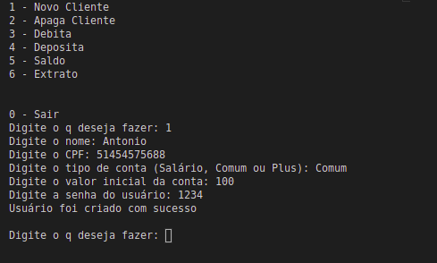
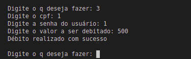
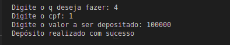
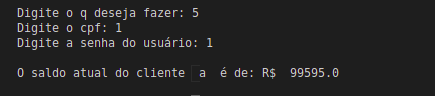
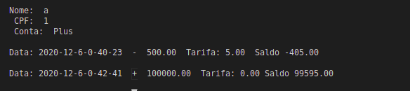

# Projeto Quem Poupa Tem

Projeto semestral da matéria de Fundamentos de Algoritmos, ministrada no Centro Universitário FEI. Consiste num software que simula um banco, realizando cadastros e transações de clientes. 

## Funcionalidade

Consiste num menu simples com 6 opções para o usuários:

```
1 - Novo Cliente
2 - Apaga Cliente 
3 - Debita 
4 - Deposita 
5 - Saldo 
6 - Extrato 
```
**Opção 1** - Pode-se criar um novo cliente no banco, definindo seu Nome, CPF, tipo de conta bancária, o valor inicial de seu saldo e a senha que será utilizada para as transações. 

Os tipos de conta e suas especificações: 
Salário: cobra taxa de 5% a cada débito realizado
Não permite débitos que deixem a conta com saldo negativo

Comum: cobra taxa de 3% a cada débito realizado
Permite um saldo negativo de até (R$ 500,00)

Plus: cobra taxa de 1% a cada débito realizado
Permite um saldo negativo de até (R$ 5.000,00)



**Opção 2** - A partir do CPF e da senha do cliente é possivel remover a conta bancária do mesmo. 


**Opção 3** - A partir do CPF e da senha é possivel debitar um valor da conta bancária, entretanto só é executado caso o valor seja condizente com o disponível e com o tipo de conta, pois cada uma possui um certo limite de crédito predefinido.



**Opção 4** - A partir do CPF e da senha é possivel depositar um valor da conta bancária.



**Opção 5** - A partir do CPF e da senha é possivel visualizar o saldo atual da conta bancária.



**Opção 6** - A partir do CPF e da senha é possivel visualizar todas os dados referentes às movimentações da conta bancária.



## Execução

Tanto no Windows quanto no Linux a execução é feita a partir da execução da linha a seguir no terminal, ou utilizando uma IDE de sua preferência. 

```bash
python main.py
```

Entretanto, utilizando apenas a linha acima é possivel que o compilador de sua máquina utilize o python em sua versão 2.7. Para resolver isso é mais vantajoso utilizar:

```bash
python3 main.py
```